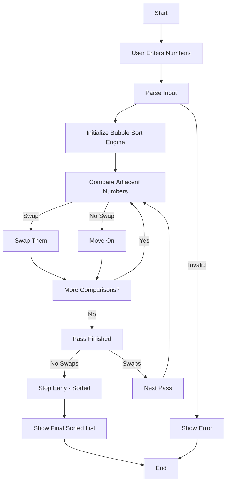

# 🫧 Interactive Bubble Sort Visualizer
**CISC 121 – Final Assignment**  
**Author:** Arvel Samson  

---

## 📸 Demo Screenshot  

---

# 🧠 Problem Breakdown & Computational Thinking

For this project, I chose **Bubble Sort** because it’s simple to understand and perfect for showing how a sorting algorithm works step-by-step. The goal was to make the process visual and interactive so users can actually see what the algorithm is doing at each stage.

To build the project, I broke the problem into smaller parts:

1. Let the user input a list of numbers.  
2. Parse the input and validate it.  
3. Sort the list using Bubble Sort.  
4. Show every comparison and swap.  
5. Make it interactive with buttons (Next Step, Auto-Run, Reset).  
6. Display everything clearly using Gradio.

---

# 🧩 Decomposition

Here are the main components I identified:

- **Input handling:** Get numbers from the user and convert them into a list.  
- **Algorithm engine:** Run Bubble Sort one step at a time so the user can follow it.  
- **Visualization:** Highlight the numbers being compared and show swaps.  
- **Controls:** Start, Next Step, Auto-Run, and Reset buttons.  
- **UI:** Use Gradio to build a clean online interface.

---

# 🔁 Pattern Recognition

Some patterns that helped build the program:

- Bubble Sort always compares **adjacent** values.  
- After each full pass, the largest value ends up at the end of the list.  
- If an entire pass happens with **no swaps**, the list is already sorted.  
- The amount of work reduces with each pass.

---

# 🎭 Abstraction

To avoid overwhelming the user, I only show:

- The current state of the list  
- Which two numbers are being compared  
- When swaps happen  
- When a pass ends  
- A final sorted list  

Things like loop indexes, memory details, and internal state are hidden because they aren’t important to the user experience.

---

# 🧠 Algorithm Design (Input → Process → Output)

### **Input**
The user types something like:
```
5, 3, 8, 1, 4
```

### **Process**
- Compare two numbers at a time  
- Swap if needed  
- Move through the list  
- Repeat until the list is sorted  
- Allow the user to move step-by-step or run automatically  

### **Output**
A colorful, easy-to-follow visualization that highlights comparisons and swaps.

---

# 🔄 Flowchart



---

# ▶️ How to Run the Program

### 1. Install the required library:
```
pip install gradio
```

### 2. Run the program:
```
python app.py
```

### 3. Open the link printed in the terminal  
Usually:  
```
http://127.0.0.1:7860
```

---

# 🧪 Testing & Verification

Here are some tests I used to confirm the program works:

| Input | Expected Result |
|-------|----------------|
| `5,4,3,2,1` | Many swaps until sorted |
| `1,2,3,4,5` | No swaps — ends early |
| `8,3,5,1` | Sorted as `[1,3,5,8]` |
| `17` | Single number, no changes |
| `4, x, 9` | Error message |

*(Add screenshots of your tests here.)*

---

# 🌐 Hugging Face Deployment  
*(Add your deployment link after you upload the project.)*

---

# 📦 GitHub Repository  
*(Add your GitHub project link here.)*

---

# ✔ Summary

This project demonstrates:

- A complete Bubble Sort implementation  
- A clean visual explanation of each comparison and swap  
- Interactive controls using Gradio  
- Strong computational thinking practices  
- Clear documentation and testing  

This meets all requirements for the assignment.


